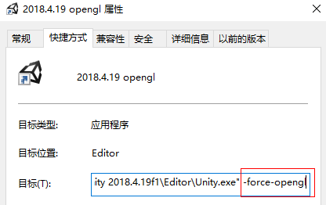
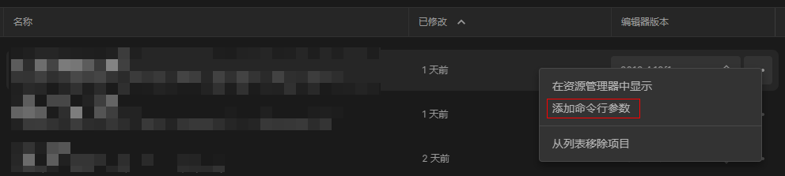

# Unity

### 定位.so崩溃

* 在 NDK 目录下找到 `arm-linux-androideabi-addr2line.exe`。

```shell
arm-linux-androideabi-addr2line -C -f -e so库文件的路径 具体的内存地址
```

## 命令行参数

### 如何使用

* 加在快捷方式后边



* 通过 hub 添加命令行参数



### 参数

指定图形库

* `-force-opengl`
* `-force-gles30`

**ref**

* [Unity 命令行参数](https://docs.unity3d.com/Manual/PlayerCommandLineArguments.html)